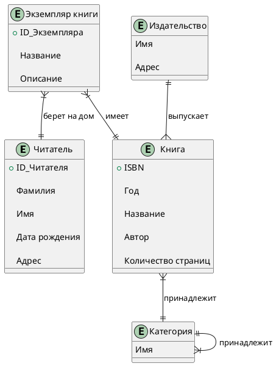

### Task 1

```plantuml
@startuml
entity "Читатель" as reader {

  + ID_Читателя

  Фамилия

  Имя

  Дата рождения

  Адрес
}


entity "Экземпляр книги" as copy {

  + ID_Экземпляра

  Название

  Описание

}


entity "Книга" as book {

  + ISBN

  Год

  Название

  Автор

  Количество страниц

}


entity "Издательство" as publisher {

  Имя

  Адрес

}

entity "Категория" as category {

  Имя

}

copy }|--|| book: "имеет"
publisher ||--{ book: "выпускает"
copy }|--|| reader: "берет на дом"
book }|--|| category: "принадлежит"
category ||--|{ category: "принадлежит"
@enduml
```
