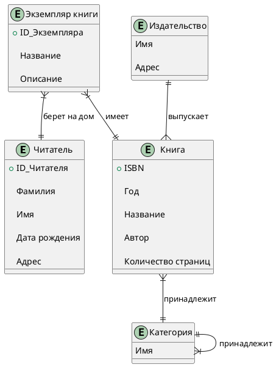
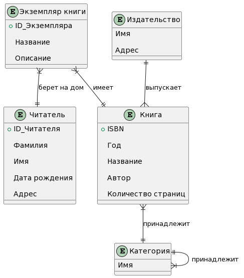
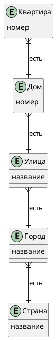
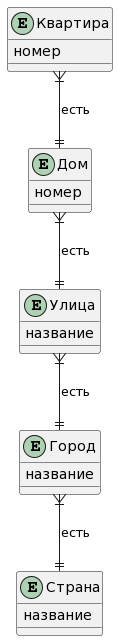
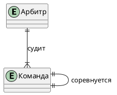
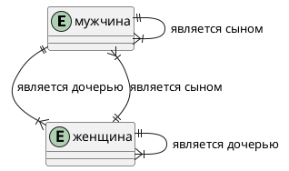
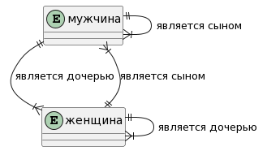
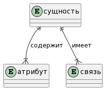

**Задача 1.** Нарисуйте E/R диаграмму для библиотечной системы на основе следующих требований:

 * В библиотеки хранятся экземпляры книг. Каждая копия (экземпляр) имеет свой уникальный номер копии, положение на полке и может быть однозначно идентифицирована с помощью номера копии вместе с ISBN. 

 * Каждая книга имеет уникальный номер ISBN, год, название, автора и количество страниц. 

 * Книги издаются издательствами. У издателя есть имя и адрес. 

 * В библиотечной системе книгам присвоена одна категория или несколько. Категории образуют иерархию, поэтому категория может быть просто другой подчиненой категорией (подкатегория). Категория имеет только имя и никаких других свойств. 

 * Каждому читателю присваивается уникальный номер. У читателя есть Фамилия, Имя, адрес и день рождения. Читатель может взять один или несколько экземпляров книг. При взятии книги записывается запланированая дата возврата.  



 **Задача 2.** Смоделируйте следующие отношения в E/R.

  *  Квартира расположена в доме на улице в городе в стране



*  Две команды играют друг против друга в футбол под руководством арбитра


*  У каждого человека (мужчины и женщины) есть отец и мать



 **Задача 3.** Смоделируйте E/R-модель в виде E/R диаграммы
 ```plantuml
@startuml
entity "сущность" as entity {

}

entity "атрибут" as attribute {

}

entity "связь" as relation {

}

entity ||--|{ attribute: "содержит"
entity ||--|{ relation: "имеет"

@enduml
```

